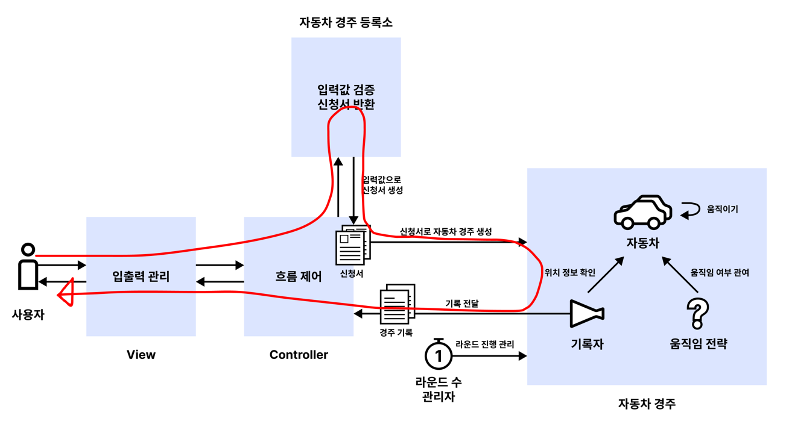

# java-racingcar-precourse

## 구현 전 생각한 구조



현실의 자동차 경주 참여 과정을 참고하여 자동차 경주 게임을 구현해 보려고 합니다.

- `사용자` : 자동차 경주 게임을 실행하는 사용자입니다.
- `신청서` : 자동차 경주 게임에 참가할 자동차 이름과 시도할 횟수를 입력하는 서류입니다.
- `운영 기관` : 자동차 경주 게임을 주관하는 기관입니다. 신청서를 검증하고 게임을 진행합니다.
- `자동차` : 자동차 경주에 참여하는 참가자이며, 이름을 가집니다.
- `자동차 경주` : 규칙을 알고 있으며, 라운드를 진행합니다.
- `심판` : 자동차 경주 진행 상황과 결과를 판단합니다.
- `전광판` : 자동차 경주의 진행 상황과 결과를 보여줍니다.

## 구현할 기능 목록

### 신청서 입력 과정

- [X] 경주할 자동차 이름을 입력받는다.
  - [X] `경주할 자동차 이름을 입력하세요.(이름은 쉼표(,) 기준으로 구분)` 문구를 출력한다.
  - [X] 자동차 이름을 입력받는다.

- [ ] 시도할 횟수를 입력받는다.
  - [ ] `시도할 횟수는 몇 회인가요?` 문구를 출력한다.
  - [ ] 시도할 횟수를 입력받는다.

### 신청서 검증 과정

- [ ] 입력받은 자동차 이름을 검증한다.
  - [ ] `쉼표(,)`로 구분되어 있는지 확인한다.
  - [ ] 1자 이상 5자 이하인지 확인한다.
  - [ ] 서로 `중복`되지 않는지 확인한다.
  - [ ] 특수 문자를 포함하지 않는지 확인한다.
  - [ ] 공백을 포함하지 않는지 확인한다.
  - [ ] 검증에 실패하면 `IllegalArgumentException`을 발생시킨 후 종료한다.
  - [ ] 검증에 성공하면 자동차를 생성한다.
- [ ] 입력받은 시도 횟수를 검증한다.
  - [ ] `양의 정수`인지 확인한다.
  - [ ] 검증에 실패하면 `IllegalArgumentException`을 발생시킨 후 종료한다.
  - [ ] 검증에 성공하면 시도 횟수를 반환한다.
- [ ] 검증에 성공하면 자동차 경주를 생성한다.

### 자동차 경주 진행 과정

- [ ] `실행 결과` 문구를 출력한다.
- [ ] 라운드를 진행한다.
  - [ ] 자동차를 규칙에 따라 이동시킨다.
  - [ ] 모든 자동차의 이동 거리를 출력한다.
- [ ] 모든 라운드가 종료되면 최종 우승자를 출력한다.
  - [ ] `최종 우승자 :` 문구를 출력한다.
  - [ ] 가장 멀리 이동한 자동차의 이름을 출력한다.
    - [ ] 최종 우승자가 여러 명일 경우 쉼표(,)로 구분하여 출력한다.
- [ ] 경주가 종료되면 프로그램을 종료한다.

---

## 실행 예시

```text
경주할 자동차 이름을 입력하세요.(이름은 쉼표(,) 기준으로 구분)
pobi,woni,jun
시도할 횟수는 몇 회인가요?
5

실행 결과
pobi : -
woni : 
jun : -

pobi : --
woni : -
jun : --

pobi : ---
woni : --
jun : ---

pobi : ----
woni : ---
jun : ----

pobi : -----
woni : ----
jun : -----

최종 우승자 : pobi, jun
```

- 입력값은 경주할 자동차 이름(이름은 쉼표(,) 기준으로 구분)과 시도할 횟수입니다.
- 경주 진행 결과는 각 자동차의 이름과 이동 거리를 출력합니다.
- 최종 결과는 가장 멀리 이동한 자동차의 이름을 출력합니다. (최종 우승자가 여러 명일 경우 쉼표(,)로 구분합니다.)

---

# 커밋 컨벤션

커밋 단위는 앞에서 정리한 구현할 기능 목록 단위로 진행됩니다.  
[AngularJS Git Commit Message Conventions](https://gist.github.com/stephenparish/9941e89d80e2bc58a153)를 참고하여 커밋 컨벤션을
구성하였습니다.

```text
<작업 유형>: <주제>
<공백>
<본문>
```

## 작업 유형

커밋의 유형을 표시합니다.

- **feat**: 새로운 기능 추가
- **fix**: 버그 수정
- **docs**: 문서 관련 변경 사항
- **refactor**: 코드 리팩토링 (버그 수정이나 기능 추가가 아닌 코드 구조 변경)
- **test**: 테스트 추가 또는 수정

## 주제

커밋의 주제를 간단히 작성합니다.

- 명령형으로 작성합니다.
- 문장 끝에 마침표를 사용하지 않습니다.
- 예시 : `fix: 자동차 이름 검증 오류 수정`

## 본문 (선택 사항)

- 변경(및 추가) 이유와 변경된 부분의 자세한 내용을 설명합니다.
- 현재 시제 문장 형태로 작성합니다.
- 이전 동작과의 차이점을 작성합니다.

## 커밋 메시지 예시

```text
docs: 구현할 기능 목록 작성
```

```text
feat: 결과 출력 기능 구현
```

```text
fix: 자동차 이름 검증 오류 수정

특수 문자를 자동차 이름으로 입력할 수 있던 문제를 해결합니다.
이전에는 특수 문자를 자동차 이름으로 사용할 수 있었지만, 이제는 특수 문자가 자동차 이름으로 사용되지 않도록 검증 로직이 추가됩니다.
```
